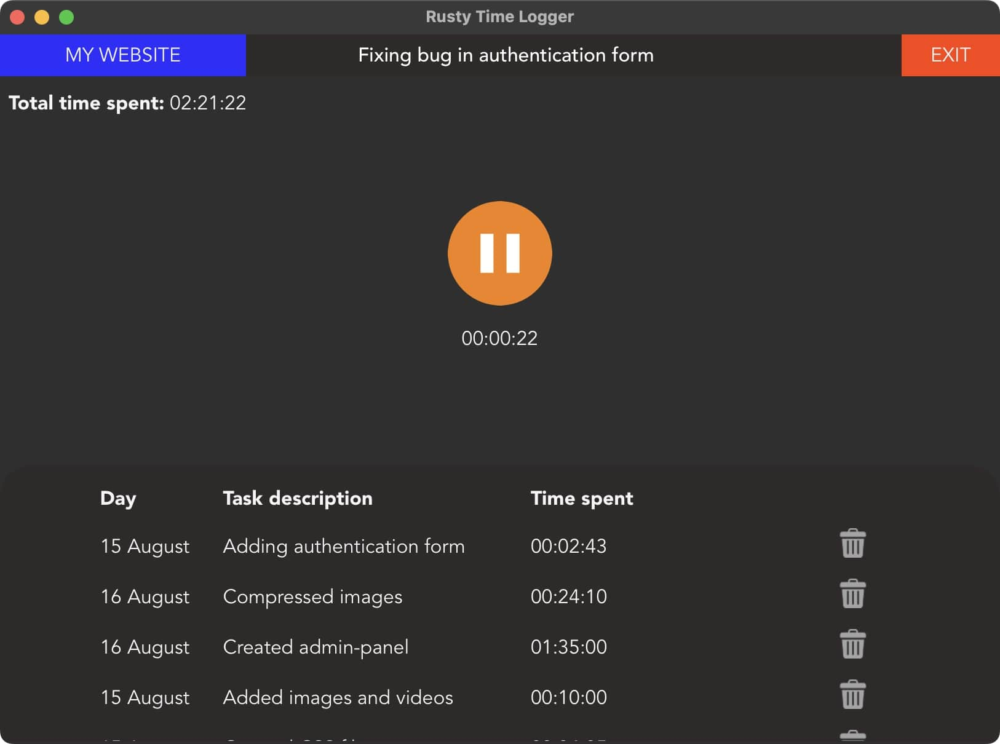
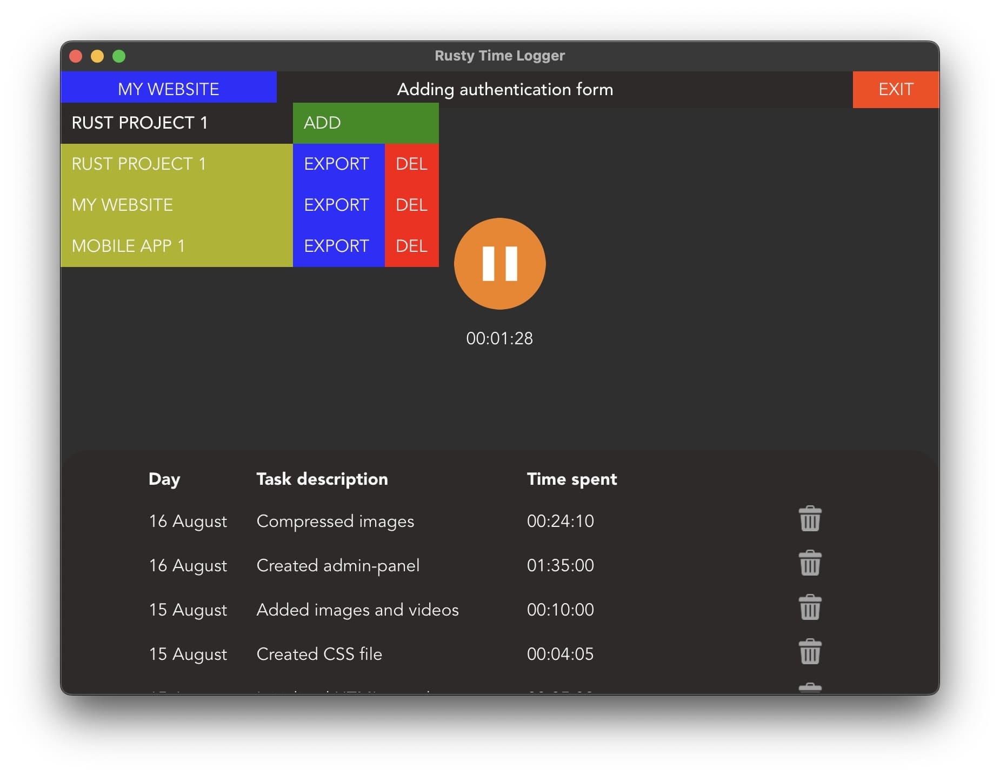

# Rusty Time Logger
The fastest time logger application in the world! Built in Rust.

I do some freelance web-development and needed a basic and easy-to-use project time logger to track the time spent on a specific project to bill clients. As a hobby-project I made my own debloated version as alternative to Toggl, Clockify or Zapier.

**Features:**
- Time track multiple projects.
- Play/pause button to start of pause timer.
- Save a finished task with a custom description.
- Export project log to a HTML table.
- View total time spent, time spent per task and a full log of the workflow.

## Screenshots
Interface

Select, add, delete or export projects

Export project log

## Technical specifications
- Rust (1.79.0)
- Tauri (1.7.1)
- Developed on UNIX

## TODO
- Fix Tuari dialog issue [(View issue)](https://github.com/tauri-apps/tauri/issues/10586#issue-2462152966)
- Use SQLite instead of CSV
- Code improvements and best practices

This was a hobby-project. So feedback is always appreciated!
